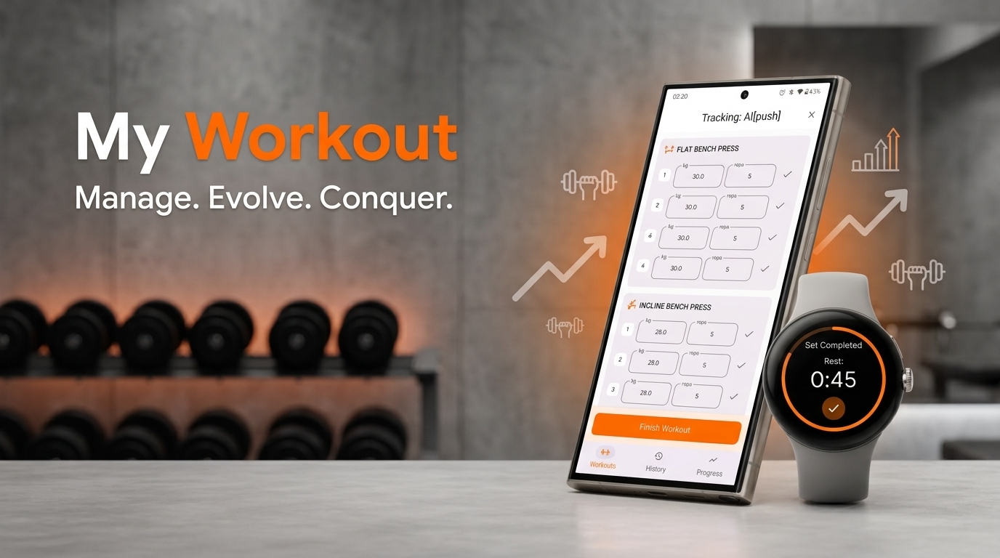
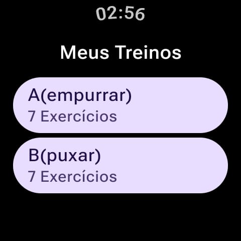
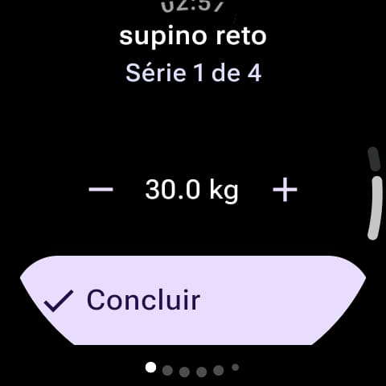
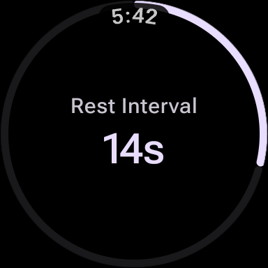

# My Workout

A comprehensive workout tracking application for Android and Wear OS, designed to help users manage their fitness routines and track progress seamlessly across devices.

## Project Overview

My Workout provides a robust platform for creating, editing, and tracking workouts. With a dedicated Wear OS companion app, users can leave their phones behind while training and sync their progress later. The app focuses on a clean, Material 3 design and efficient data management.

## Features

- **Workout Management**: Create and organize custom workouts with multiple exercises.
- **Exercise & Set Detail**: Fine-tune your training with specific weights, repetitions, and rest intervals for each set.
- **Wear OS Execution**: Execute your workouts directly from your wrist with a specialized Wear OS app.
- **Data Synchronization**: Automatic two-way synchronization between the mobile app and Wear OS using the Wearable Data Layer API.
- **Rest Timer**: Integrated rest timer during workout tracking to ensure optimal recovery between sets.
- **Workout History**: Review past sessions and track your consistency over time.
- **Gamification System**: Stay motivated with an XP-based progression system, player levels, and training streaks.
- **Advanced Analytics**: Visualize your progress with weekly volume charts and detailed exercise history.
- **Achievements & Badges**: Unlock badges for reaching milestones like streak goals, high volume, or intense workouts.
- **Wear OS XP Feedback**: Real-time visual feedback on your wrist as you gain XP for each completed set.
- **Localization**: Full support for English and Portuguese (pt-BR).

## Gamification & Progression

"My Workout" turns your fitness journey into a rewarding experience:

- **XP System**: Earn 10 XP for every set completed and a 50 XP bonus for finishing a full workout session.
- **Leveling**: Progress through levels as you accumulate XP. The formula follows a square root curve, making early levels quick to achieve while higher levels represent true dedication.
- **Streaks**: Maintain a training streak to show your consistency. Training on consecutive days earns you the "fire" indicator and extra bonus XP.
- **Achievements**: Earn specialized badges for milestones:
    - **Elite Warrior**: 7-day training streak.
    - **Weightlifter**: Move over 10 tons of total volume in a single session.
    - **Repetition Machine**: Complete more than 20 sets in one workout.

## Screens

### Mobile App
|            Workout Tracking             |            Workout Details             |
|:---------------------------------------:|:--------------------------------------:|
|  |  |

### Wear OS
|             Workout List              |                Execution                |              Rest Timer               |
|:-------------------------------------:|:---------------------------------------:|:-------------------------------------:|
|  |  |  |

## Download

## Architecture

The project follows modern Android development best practices and a **Feature-based Modular Architecture** using the **Bridge/Impl** (API/Implementation) pattern:

- **Modularization**: Code is organized into independent feature modules and core libraries to improve build times, encapsulation, and scalability.
- **Bridge/Impl Pattern**: Features are split into a `:bridge` module (public API, navigation keys) and an `:impl` module (internal UI, logic, and DI), preventing tight coupling between features.
- **MVI (Model-View-Intent)**: Utilizes a robust MVI pattern with a base `MviViewModel` to ensure predictable state management and unidirectional data flow.
- **State-Driven Events**: One-off events (like navigation) are handled as part of the UI state, following the latest Android architecture recommendations.
- **Jetpack Compose**: 100% declarative UI for both mobile and Wear OS modules.
- **Navigation 3**: Utilizes the latest Jetpack Navigation 3 for state-driven, adaptive navigation.
- **Room Database**: Local data persistence using Room.
- **Hilt**: Dependency injection for modular and scalable code.
- **Wearable Data Layer**: Robust communication and data sync between handheld and wearable devices.

## Project Structure

- **`:app`**: The mobile application entry point and navigation orchestrator.
- **`:wear`**: The Wear OS companion application module.
- **`:core:*`**: Shared infrastructure modules:
    - `:core:ui`: Common UI components, themes, and base MVI classes.
    - `:core:data`: Centralized data logic, repositories, and persistence (Room).
    - `:core:navigation`: Navigation infrastructure and base types.
    - `:core:common`: Base utilities and extensions.
- **`:features:*`**: Business features organized by the Bridge/Impl pattern:
    - `:features:[name]:bridge`: Public API and navigation destinations.
    - `:features:[name]:impl`: Feature-specific UI, ViewModels, and logic.

## Setup Instructions

### Prerequisites

- Android Studio Ladybug (2024.2.1) or later.
- Android SDK 34 or higher.

### Installation

1. Clone the repository to your local machine.
2. Open the project in Android Studio.
3. Sync the project with Gradle files.
4. Run the `:app` module on an Android device or emulator.
5. Run the `:wear` module on a Wear OS device or emulator (ensure the devices are paired if testing sync).
