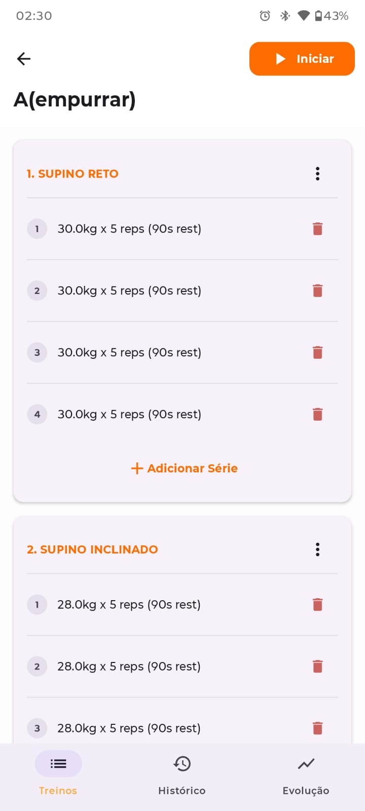
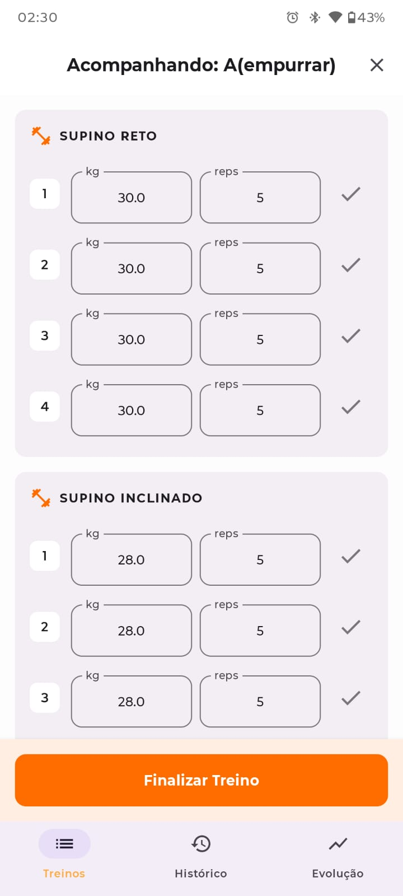

# My Workout

A comprehensive workout tracking application for Android and Wear OS, designed to help users manage their fitness routines and track progress seamlessly across devices.

## Project Overview

My Workout provides a robust platform for creating, editing, and tracking workouts. With a dedicated Wear OS companion app, users can leave their phones behind while training and sync their progress later. The app focuses on a clean, Material 3 design and efficient data management.

## Features

- **Workout Management**: Create and organize custom workouts with multiple exercises.
- **Exercise & Set Detail**: Fine-tune your training with specific weights, repetitions, and rest intervals for each set.
- **Wear OS Execution**: Execute your workouts directly from your wrist with a specialized Wear OS app.
- **Data Synchronization**: Automatic two-way synchronization between the mobile app and Wear OS using the Wearable Data Layer API.
- **Rest Timer**: Integrated rest timer during workout tracking to ensure optimal recovery between sets.
- **Workout History**: Review past sessions and track your consistency over time.
- **Localization**: Full support for English and Portuguese (pt-BR).

## Screens

### Mobile App
| Workout Tracking | Workout Details |
| :---: | :---: |
|  |  |

### Wear OS
| Workout List | Execution | Rest Timer |
| :---: | :---: | :---: |
|  |  |  |

## Download

## Architecture

The project follows modern Android development best practices and Clean Architecture principles:

- **MVVM (Model-View-ViewModel)**: Decouples UI logic from business logic for better testability and maintainability.
- **Jetpack Compose**: 100% declarative UI for both mobile and Wear OS modules.
- **Navigation 3**: Utilizes the latest Jetpack Navigation 3 for state-driven, adaptive navigation.
- **Room Database**: Local data persistence using Room for reliable offline access.
- **Hilt**: Dependency injection for modular and scalable code.
- **Wearable Data Layer**: Robust communication and data sync between handheld and wearable devices.
- **Coroutines & Flow**: Asynchronous programming for responsive UI and data streams.

## Project Structure

- `:app`: The mobile application module.
- `:wear`: The Wear OS companion application module.
- `:shared-data`: A shared library module containing data models, database, and repository logic used by both app and wear modules.

## Setup Instructions

### Prerequisites

- Android Studio Ladybug (2024.2.1) or later.
- Android SDK 34 or higher.

### Installation

1. Clone the repository to your local machine.
2. Open the project in Android Studio.
3. Sync the project with Gradle files.
4. Run the `:app` module on an Android device or emulator.
5. Run the `:wear` module on a Wear OS device or emulator (ensure the devices are paired if testing sync).
